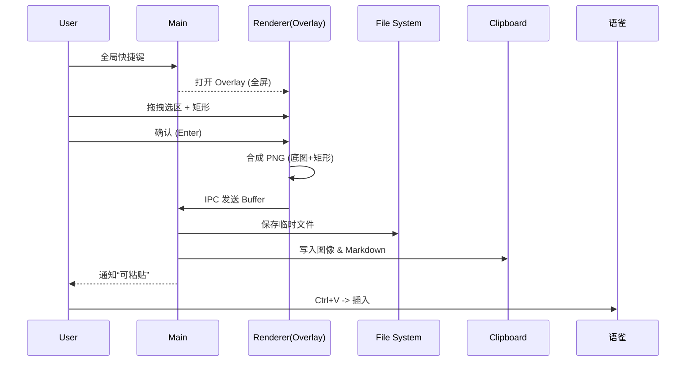

# Yuque Snap （工作名）— 语雀高频插图提效小工具

> v0.1 目标：把“截图（带基础标注）→ 插入语雀”链路从 15~20 秒、7+ 步，压缩到 ≤9 秒、≤4 步。  
> 仅聚焦“速度 + 不切换应用”，不追求全面标注功能。

---

## 1. 背景 & Problem

在语雀撰写技术/需求文档时，频繁需要插入带矩形（偶尔箭头）标注的局部界面截图。  
当前主流做法（QQ / 微信 / 系统截图）会导致：

| 步骤 | 描述 | 典型耗时 (s) | 认知/流被打断点 |
|------|------|--------------|----------------|
| 1 | 触发截图想法 | ~1 | 写作 → 操作模式切换 |
| 2 | 切到截图工具（QQ/微信/快捷键） | 2–4 | 应用切换 |
| 3 | 选区截取 | 2–3 | - |
| 4 | 标注（矩形/箭头/文字） | 3–8 | 工具 UI & 精细调整 |
| 5 | 复制 | 1 | - |
| 6 | 回到语雀编辑器 | 1–2 | 再次应用切换 |
| 7 | 粘贴 & 等待上传 | 2–4 | 上传进度等待 |
| 合计 | 12–23（常见平均 ~15） | - | 多次上下文切换，打断思路 |

痛点总结：
- 高频（≥20 次/日） → 累积耗时显著
- 多次应用切换破坏写作“流”
- 标注需求很基础（矩形，偶尔箭头），却不得不使用重工具
- 命名、Markdown 粘贴格式不统一，后期整理困难

---

## 2. 核心价值命题（Value Proposition）

在语雀写作时：按下全局快捷键 → 选区（+ 可选矩形标注）→ 一次确认 → 立刻粘贴。  
目标：让“是否插图”这个微决策的成本 ≈ ‘复制一段文字’。

---

## 3. v0.1 定义

聚焦：速度验证。  
MVP 必须（Must）：
1. 全局快捷键触发
2. 区域选取
3. 单一标注：矩形（固定样式即可）
4. 导出：生成临时文件 (file://) + Markdown 片段 ``
5. 自动写入剪贴板（图像 + Markdown 文本二选一 / 先图像为主）
6. 用户在语雀 Ctrl+V 插入（暂不做自动 DOM 注入）

Not in v0.1（明确排除）：
- 多形状（箭头、文字、涂抹、马赛克）
- OCR
- 历史面板 / 搜索
- 批量 / 连拍
- 自动识别文档 slug
- 云图床 / OSS 上传
- 多语言长文档（仅英文简介）
- 自动更新

---

## 4. Success Metrics（成功判据）

| 指标 | 目标 | 说明 |
|------|------|------|
| 平均时长下降 | ≥40% | 本人 + 2 用户，各 5 次基线 vs 工具 |
| 步骤数 | ≤4 步 | 触发 → 选区+标注 → 完成生成 → 粘贴 |
| 二次使用意愿 | ≥2/3 用户 ≥4/5 评分 | “是否继续使用” Likert 量表 |

阶段推进（预期）：
- v0.1 通过 ≥40%：进入功能“补齐期”（箭头 / 命名智能化）
- ≥60%（后续）：探索团队共享、云端同步

---

## 5. 用户画像（Target User）

- 角色：前端工程师 / 产品经理 / 测试 / 研发支持
- 行为特征：语雀为主文档阵地；单日插入截图 ≥20 次；标注需求 80% 为矩形框强调区域
- 成功状态：截图插入操作成为“肌肉记忆”，写作不再中断去找 QQ/微信窗口

不覆盖：
- 需要复杂标注、批注协作、界面高保真设计的人群（这属于另一个工具空间）
- 偶尔一两次截屏用户（优化收益不足）

---

## 6. 使用预览（占位 / 未来替换 GIF）

（TODO：待 v0.1 完整链路打通后录制 6~8 秒 GIF：展示热键 → 选区 → 矩形 → 粘贴成功）

文本演示（模拟）：
1. 按 Ctrl+Alt+S
2. 拖拽区域（出现半透明遮罩 + 矩形）
3. 回车确认（或点击“完成”）
4. 切回（若焦点未失）Ctrl+V → 语雀插入图片

---

## 7. 快速开始（开发版）

```bash
# 启动前
corepack enable
pnpm install

# （未来）开发调试
pnpm dev     # Electron 主进程 + 渲染进程
# 目前（v0.1）只有工具函数 & 测试
pnpm test
```

构建（预留）：
```bash
# 未来引入 electron-builder 后
pnpm build
# 输出 dist/ + 安装包
```

---

## 8. 目录结构（计划 / v0.1 初始）

```text
.
├─ README.md
├─ docs/
│  ├─ baseline_measure.md        # 基线计时记录
│  └─ metrics.md (TODO)          # 聚合实验数据
├─ src/
│  ├─ main/                      # Electron 主进程（TODO）
│  │  ├─ app.ts
│  │  └─ shortcuts.ts
│  ├─ preload/                   # 安全桥 (TODO)
│  ├─ renderer/                  # 区域选择 & 标注 UI (TODO)
│  ├─ capture/
│  │  ├─ fullscreen.ts           # 全屏捕获 (TODO)
│  │  └─ crop.ts                 # 裁剪函数 (TODO)
│  ├─ annotate/
│  │  └─ rectangle.ts            # 矩形绘制逻辑 (TODO)
│  ├─ compose/
│  │  └─ merge.ts                # 底图 + 标注层合成 (TODO)
│  ├─ clipboard/
│  │  ├─ markdown.ts             # 生成 Markdown
│  │  └─ copy.ts (TODO)
│  ├─ util/
│  │  ├─ filename.ts
│  │  └─ time.ts (TODO)
│  └─ pipeline/
│     └─ run.ts (TODO)
├─ tests/
│  ├─ markdown.test.ts
│  └─ filename.test.ts (TODO)
├─ temp/ (gitignore)             # 临时截图
├─ pnpm-lock.yaml
├─ tsconfig.json
└─ .gitignore
```

---

## 9. 开发路线图（Roadmap Week 1）

| Day | 目标 | 产出 |
|-----|------|------|
| 1 | 骨架 & 基础函数 | README / markdown.ts / filename.ts / test |
| 2 | 基线计时 & pipeline 伪造 | baseline_measure.md 填数据 / dummy capture |
| 3 | 全屏截图 PoC | fullscreen.ts 输出文件 |
| 4 | 区域选择 Overlay | 拖拽坐标 / 裁剪 |
| 5 | 矩形标注 & 合成 | rectangle.ts / merge.ts |
| 6 | 端到端耗时测量 | 5 次操作记录 |
| 7 | 用户试用 & 指标汇总 | metrics.md / 复盘 |

Backlog（排队，未承诺）：
- 箭头标注
- 自动 docSlug（解析页面标题）
- OCR
- 历史画廊 / 搜索
- 云图床（可配置）
- 多语言 README
- 自动更新
- 团队共享（上传元信息）

---

## 10. 技术选型

| 需求 | 方案 | 说明 |
|------|------|------|
| 全局快捷键 | Electron globalShortcut | 注册 Ctrl+Alt+S（Windows/Linux） / Cmd+Alt+S（macOS） |
| 屏幕捕获 | desktopCapturer + getUserMedia | 渲染进程转 video → canvas → PNG Buffer |
| 区域选择 | 无边框全屏透明窗口 + JS 事件 | 遮罩层 + 选区矩形渲染 |
| 标注 | Canvas 叠加层 | 仅矩形 stroke（固定颜色/线宽） |
| 合成 | Canvas 2D drawImage + stroke | 导出 PNG |
| 命名 | generateName(docSlug, date) | 格式：yuque_YYYYMMDD_HHmmss.png |
| 剪贴板 | Electron clipboard + nativeImage | 同时写入图像 & Markdown |
| 临时存储 | OS 临时目录 / temp/ | 避免污染仓库；定期清理策略（后续） |

---

## 11. 流程（Pipeline v0.1）



---

## 12. Benchmark 设计

基线采集（docs/baseline_measure.md）：
- 每个用户：5 次原流程，记录时间（手机秒表 / 软件）
- 取平均值 baseline_avg

工具测试：
- 相同步骤（热键→选区→标注→确认→粘贴成功）
- 5 次，记录 tool_avg

计算：
```
reduction% = (baseline_avg - tool_avg) / baseline_avg * 100
```

≥40% 即达成 v0.1 成功条件。

---

## 13. 命名规范

| 类别 | 规则 | 示例 |
|------|------|------|
| 截图文件 | yuque_YYYYMMDD_HHmmss.png | yuque_20250810_142355.png |
| 临时目录 | temp/ | temp/yuque_... |
| 分支（可选） | feat/<topic> / fix/<topic> | feat/overlay |
| 提交消息（推荐） | type(scope): summary | feat(capture): add fullscreen grab |

提交类型（Conventional 简化版）：feat / fix / chore / docs / refactor / test / perf / build

---

## 14. 自我否决脚本（行动化）

| 否决念头 | 行动 |
|----------|------|
| “已有 QQ/微信截图，我重复造轮子” | 立刻改 markdown.ts 或 filename.ts 一行 + learning.log 写入改动 + 重读这条：我验证的是语雀链路速度差异。 |
| “功能太少没人用” | 检查 Success Metrics 是否采集完成；未完成禁止添加新功能。 |
| “标注不如专业工具” | 确认范围只含矩形；删除新增加的形状 TODO。 |
| “失败=我不坚持” | 记录今日原子产出（文件/测试/计时），commit，朗读：失败 = 积累截图管线资产。 |

（同步保存在 idea.md）

---

## 15. 为什么不是浏览器插件？

| 评估项 | 浏览器扩展 | Electron 桌面 |
|--------|------------|---------------|
| 截桌面其它应用 | ❌ 限制在浏览器标签 | ✅ 系统级 |
| 全局快捷键一致性 | 受限 / 前景窗口需浏览器 | ✅ 原生注册 |
| 标注 UI 灵活性 | 只能在网页 DOM | ✅ 任意窗口 / Canvas |
| 后续扩展（云/托盘） | 受限 | ✅ |

结论：速度验证阶段优先 Electron。

---

## 16. 安全 & 隐私（初稿）

- 本地优先：所有截图默认保留在本地临时目录，不上传
- 不会自动扫描/采集其他窗口文字内容（未加入 OCR）
- 不采集使用行为分析数据（后续若需将显式提示）
- 清理策略（TODO）：提供“清空最近 N 天临时图片”按钮

---

## 17. 性能原则（后续补充）

| 方面 | v0.1 目标 |
|------|----------|
| 截屏→生成 PNG 耗时 | ≤300ms（1080p 全屏裁剪后） |
| Overlay 启动 | ≤150ms |
| 内存占用（常驻） | < 150MB（后续优化） |

---

## 18. 已知风险 & 假设

| 假设 | 风险 | 缓解 |
|------|------|------|
| 速度差异足够显著吸引留存 | 用户主观“不嫌麻烦” | 数据化展示节省时长（统计总节约秒数） |
| 单矩形足够 80% 场景 | 实际箭头需求更高 | 记录补充请求数量，≥30% 请求再实现 |
| 用户愿意手动粘贴 | 希望自动插入 | v0.1 验证后再做语雀 DOM 集成（可选 content script） |
| file:// 剪贴板粘贴稳定 | 某些 OS/浏览器策略差异 | 回退策略：直接复制图像二进制到剪贴板 |

---

## 19. FAQ（持续补充）

Q: 为什么粘贴时先看到 file:// 再变图片？  
A: 语雀上传解析需要时间，最终会替换为正式图床 URL。

Q: 可以自定义文件名前缀吗？  
A: v0.1 固定 “yuque”；后续支持：自动提取文档标题 → slug。

Q: 能直接生成 Markdown 而不是图片粘贴吗？  
A: 当前复制同时含图片 & markdown 文本，语雀优先插入图片。后续可切换模式。

---

## 20. 英文简介（Brief EN）

Fast annotated screenshot to Yuque: global hotkey → region + rectangle → paste in ≤9s (≥40% faster).  
v0.1 focuses on speed, not rich annotation.

---

## 21. Contributing（未来）

暂不接受外部复杂特性 PR。欢迎：
- 修复 Bug
- 优化 README / 文档
- 小范围性能优化

流程（后续）：
1. Fork → feature 分支
2. pnpm test 通过
3. PR 模板自检列表打勾

---

## 22. License

MIT (计划) — 待添加 LICENSE 文件。

---

## 23. Changelog（模板占位）

```
## [0.1.0] - 2025-08-XX
### Added
- 基础函数 markdown / filename
- 项目结构

### Planned
- 全屏截图
- 区域裁剪
- 矩形标注
```

（后续引入 CHANGELOG.md）

---

## 24. Metrics 汇总（占位）

| 用户 | Baseline Avg (s) | Tool Avg (s) | Reduction % | Reuse Intent (1-5) | Notes |
|------|------------------|--------------|-------------|--------------------|-------|
| U1 |  |  |  |  |  |
| U2 |  |  |  |  |  |
| U3 |  |  |  |  |  |
| 平均 |  |  |  | - | - |

---

## 25. TODO 看板（精简）

| 状态 | 项目 | 说明 |
|------|------|------|
| DOING | 全屏捕获 PoC | desktopCapturer |
| TODO | Overlay 拖拽 | 透明窗口 + 坐标 |
| TODO | 裁剪函数 | crop(canvas, rect) |
| TODO | 矩形标注层 | 仅 strokeStyle 固定 |
| TODO | 合成导出 | canvas merge |
| TODO | 剪贴板写入 | image + markdown |
| TODO | 端到端计时 | 5 次取平均 |
| BACKLOG | 箭头 | 后续 |
| BACKLOG | OCR | 后续 |
| BACKLOG | 历史面板 | 后续 |

（真正执行时保持 ≤7 个“活跃/待做”条，避免膨胀）

---

## 26. 学习 / 复盘（引用 learning.log）

示例（保持短句）：
```
Day1: skeleton + tests; 明确指标后避免加功能冲动
Day2: baseline 平均 16.2s; dummy pipeline 输出 markdown
```

---

## 27. 下一步立即行动（开发者自用）

今天：完成全屏截图 PoC（fullscreen.ts）  
验证：生成 PNG 大小 > 0，耗时打印  
Commit 规范：feat(capture): add fullscreen grabbing

---

（文档到此，随版本演进迭代；保持“真实数据优先”原则。）
